# 【笔记】业余无线电通信

业余无线电通信（第4版），童效勇、陈方

## 第1章 什么是业余无线电通信

无线电通信技术
业余无线电通信 / 业余通信（Amateur Radio）：无线电收信、发信
业余无线电爱好者（Radio Amateur）：火腿（HAM）
业余无线电家：获得发信执照、精通业余无线电技术和通信的爱好者

### 1.1 什么是业余电台

国际电信联盟组织（ITU，International Telecommunication Union）

业余业务：供业余无线电爱好者进行自我训练、相互通信和技术研究的无线电通信业务

业余电台（Amateur Radio Station）：用于业余业务的电台
	两种：个人设置、团体（单位）设置
	三类：A、B、C

收听台（SWL，Short Wave Listener）：只收听而不发射的电台

俱乐部电台（Club Station）：由团体（单位）申请设置的业余电台
	集体业余电台：学校、各类校外青少年教育机构、协会
		2013年前：呼号前缀为“BY”
		现在：俱乐部电台和个人电台的呼号前缀已不作区分

个人业余电台：爱好者本人申请设置并由其本人操作使用

### 1.2 业余无线电的起源及在我国的发展历程

### 1.2.1 业余无线电通信的起源

17世纪：麦克斯韦（英国科学家），建立了完整的电磁场理论
1887年：赫兹（德国物理学家），第一次用实验证实了电磁波的存在
1895年：马可尼（意大利人）——业余无线电鼻祖，成功进行了通报实验，使无线电通信成为现实
1901年12月：马可尼，成功地实现了电波跨越大西洋的实验
1910年：澳大利亚成立了业余无线电爱好者组织
1913年：英国成立了业余无线电爱好者组织
1914年：美国成立了业余无线电爱好者组织

短波成为人们远程通信的主要波段
“短波是业余无线电爱好者首先发现的”
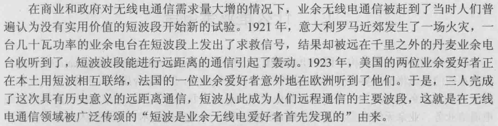

### 1.2.2 中国业余无线电历史的简述

略

### 1.2.3 我国业余无线电爱好者在“突发事件”中的几个真实故事

略

## 1.3 怎样寻找业余电台

### 1.3.1 电磁波以及波段的划分

电磁感应：
	当电流流经导体时，导体周围会产生磁场
	当导体和磁力线发生相对切割运动时，导体内会感生电流

电磁波：······这种迅速向四面八方扩散的交替变化着的磁场和电场的总和
	频率：磁场或电场每秒钟内周期变化的次数
		基本单位：赫兹（Hz）

无线电波：频率在3000GHz以下，不通过导线、电缆或人工导波等传输媒介，在空间辐射传播的电磁波
	在空间传播的速度：300000km/s
	波长：波速和频率的比值
		单位：米（m）

在无线电波到达之处，导体能从中感生出电流，这个电流的大小、方向的变化规律和起初产生电磁场的电流的变化规律完全一致
→ 无线电通信：无线电波可以使信息（即初始电流的某种变化规律）通过空间传播实现远距离传递

ITU：把无线电波划分为12个频段

| 段号 |   频段名称    |     频率范围     |                  Hz                   | 波段名称 |                波长范围                 |                   m                   |
| :--: | :-----------: | :--------------: | :-----------------------------------: | :------: | :-------------------------------------: | :-----------------------------------: |
|  1   |    极低频     |    3Hz ~ 30Hz    |  3×100 ~ 3×101  |  极长波  | 1×105km ~ 1×104km |  1×108 ~ 1×107  |
|  02  |    超低频     |   30Hz ~ 300Hz   |  3×101 ~ 3×102  |  超长波  | 1×104km ~ 1×103km |  1×107 ~ 1×106  |
|  3   |    特低频     |  300Hz ~ 3000Hz  |  3×102 ~ 3×103  |  特长波  |             1000km ~ 100km              |  1×106 ~ 1×105  |
|  4   | 甚低频（VLF） |  3kHz ~ 30 kHz   |  3×103 ~ 3×104  |  甚长波  |              100km ~ 10km               |  1×105 ~ 1×104  |
|  5   |  低频（LF）   |  30kHz ~ 300kHz  |  3×104 ~ 3×105  |   长波   |               10km ~ 1km                |  1×104 ~ 1×103  |
|  6   |  中频（MF）   | 300kHz ~ 3000kHz |  3×105 ~ 3×106  |   中波   |              1000m ~ 100m               |  1×103 ~ 1×102  |
|  7   |  高频（HF）   |   3MHz ~ 30MHz   |  3×106 ~ 3×107  |   短波   |               100m ~ 10m                |  1×102 ~ 1×101  |
|  8   | 甚高频（VHF） |  30MHz ~ 300MHz  |  3×107 ~ 3×108  |   米波   |                10m ~ 1m                 |  1×101 ~ 1×100  |
|  9   | 特高频（UHF） | 300MHz ~ 3000MHz |  3×108 ~ 3×109  |  分米波  |                1m ~ 0.1m                | 1×100 ~ 1×10-1  |
|  10  | 超高频（SHF） |   3GHz ~ 30GHz   | 3×109 ~ 3×1010  |  厘米波  |               10cm ~ 1cm                | 1×10-1 ~ 1×10-2 |
|  11  | 极高频（EHF） |  30GHz ~ 300GHz  | 3×1010 ~ 3×1011 |  毫米波  |               10mm ~ 1mm                | 1×10-2 ~ 1×10-3 |
|  12  |    至高频     | 300GHz ~ 3000GHz | 3×1011 ~ 3×1012 |  丝米波  |               1mm ~ 0.1mm               | 1×10-3 ~ 1×10-4 |

1000Hz = 1kHz
1000kHz = 1MHz
1000MHz = 1GHz

频率范围：含上限，不含下限

微波：分米波、厘米波、毫米波、丝米波

国际电信联盟（ITU）：将世界分为3个区
	业余频段：
		第1区：3.5MHz ~ 3.8MHz
		第2区：3.5MHz ~ 4.0MHz
		第3区：3.5MHz ~ 3.9MHz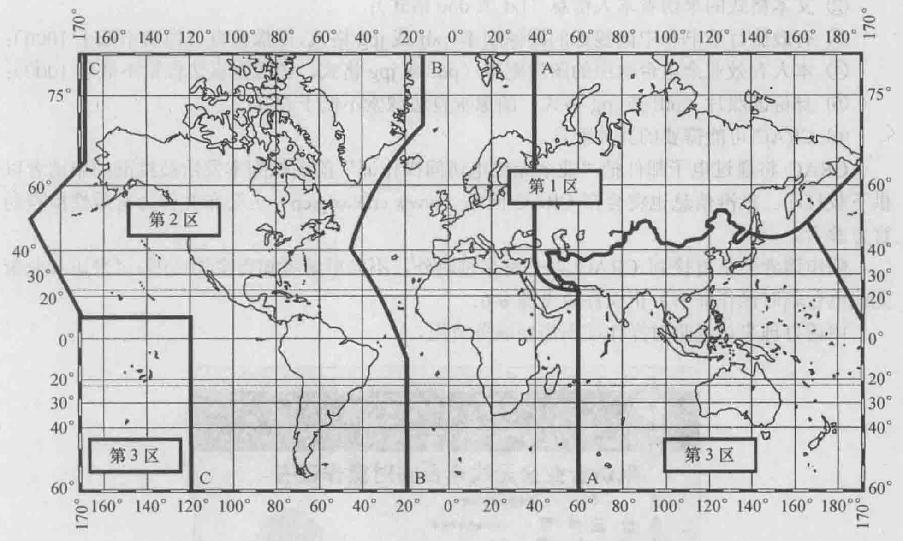
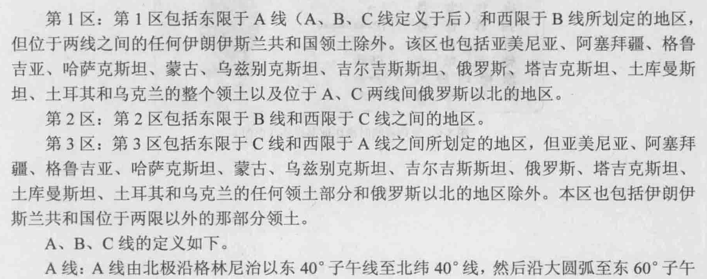
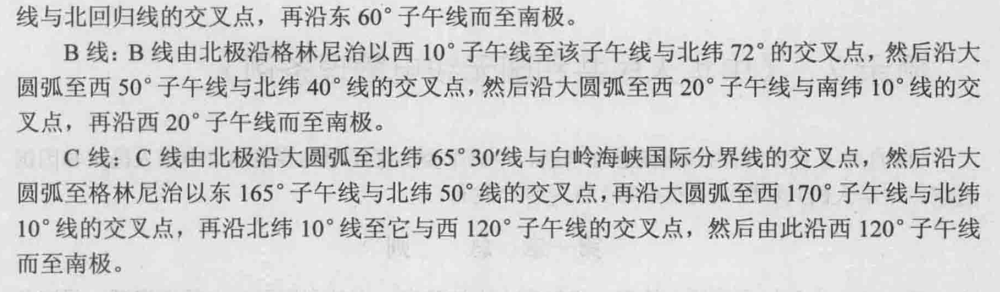

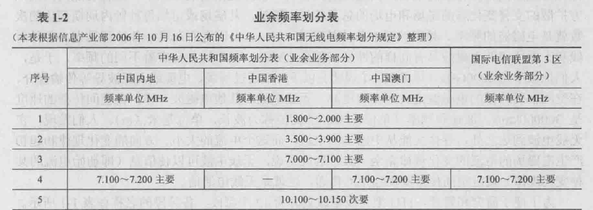
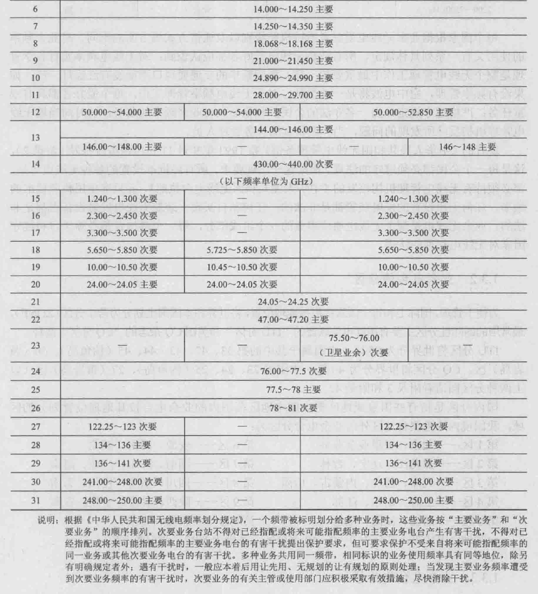

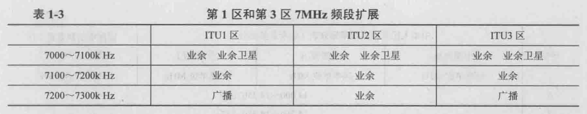

### 1.3.2 业余电台的分区

分区（ZONE）
最常用的国际性分区：ITU分区、CQ分区

国际电信联盟：ITU分区
	中国：第33、42、43、44、45（钓鱼岛）、50（黄岩岛）区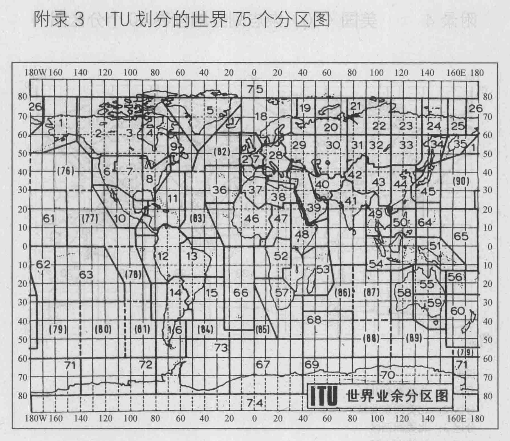

美国CQ杂志：CQ分区
	中国：第23、24、25（钓鱼岛）、27（黄岩岛）区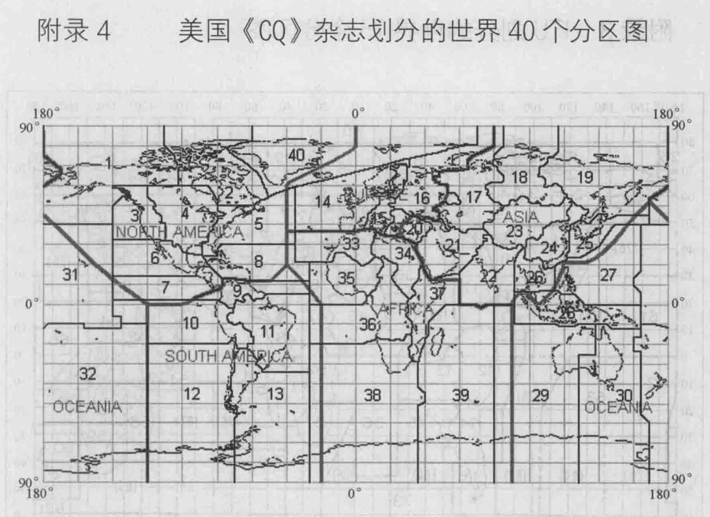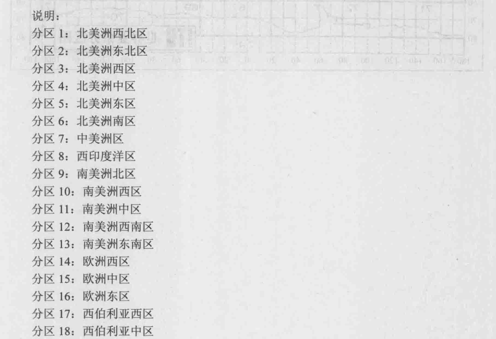
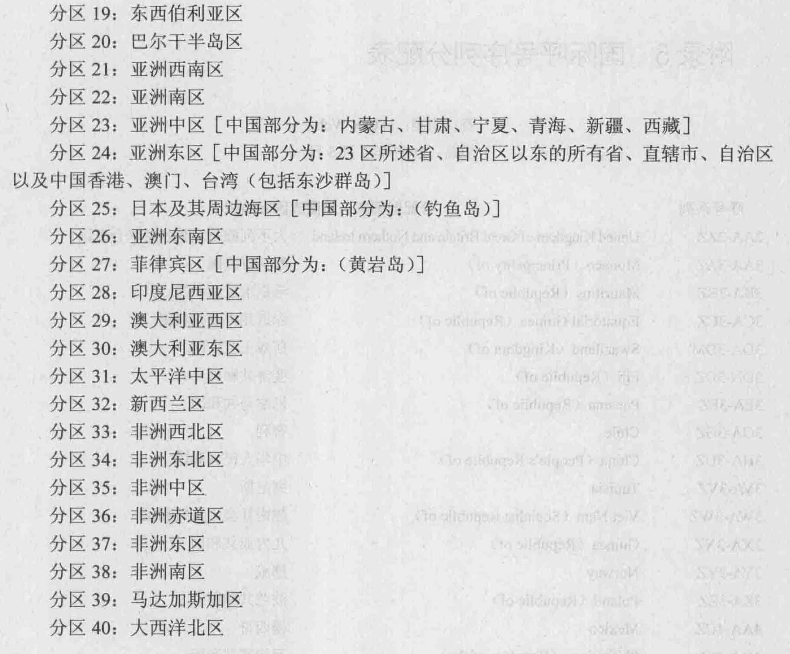

国内分区
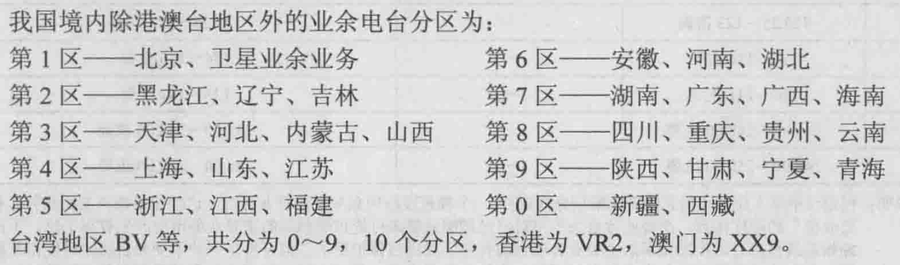

### 1.3.3 业余电台的呼号

每一个业余电台的呼号都是唯一的

业余电台呼号：
	第一部分：字母前缀，代表国家，“B”
	第二部分：电台种类，一位英文字母
	第三部分：电台分区，一位阿拉伯数字
	第四部分：后缀，区分同一分区内不同的业余电台，不超过四位的字母或字母和数字的组合

字母前缀（Prefix）：每个业余电台所属国家或地区的标志
	1~2个英文字母或字母和数字组合
	国际呼号序列分配表（附录5）
		B：中国
		W：美国
		A5：不丹
		3X：几内亚
	中国：BAA~BZZ、XSA~XSZ、3HA~3UZ
	香港地区：VR2
	澳门地区：XX9
	台湾地区：BV、BO、BW、BX等

电台种类：
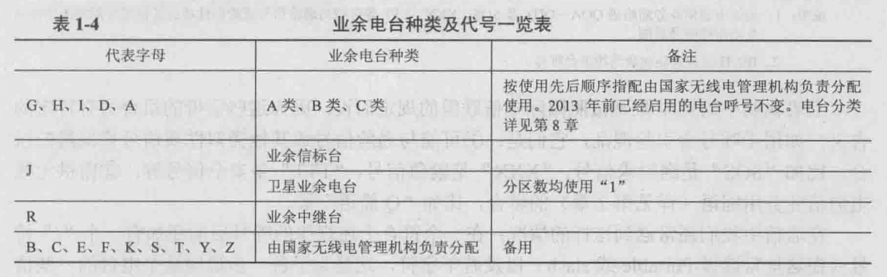

电台分区：
	数字“零”：
		读作：Zero
		写作：Ø，避免与字母“O”混淆

后缀：
	第一个字母：同一分区内不同的省、市
		4AA~4HZZ：上海
		4QA~4XZZ：江苏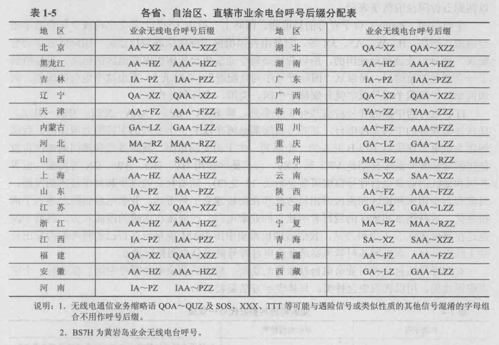

说明的第1条：
	① 可能与遇险信号或其他类似性质信号相混淆的组合
		SOS：遇险求救信号
		XXX：紧急信号
		TTT：安全信号
	② 留供无线电通信业务用缩语，比如“Q简语”等

呼号后面加有一个“/”符号（读作portable / slash）以及若干字符：为了进一步说明这个电台的一些情况而加的附注
	/M：在陆地上移动（读作portable mobile / 只读mobile）
	/AM：在空中移动
	/MM：在海上移动
	/QRP：发信机输出功率在5W以下的小功率电台
	/P：便携电台

在设台地以外的地方操作：
	在呼号的前面加：所在地呼号前缀、分区数、斜线符号
		KH6/W6KZ：美国6区爱好者在夏威夷发射
	我国：字母B、操作地业余无线电台分区号、斜线符号、本人业余无线电台呼号
		B1/BA4RC：设台地在江苏省的业余电台BA4RC到北京操作

一个爱好者 / 一个单位在设置业余无线电台并取得电台执照的时：可以取得一个业余电台呼号
	当电台类别发生变化时（如先设A类电台，后设B类电台）：呼号不变

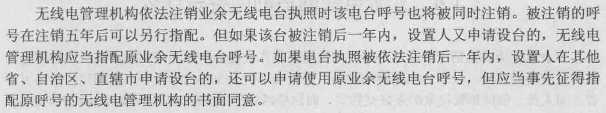

### 1.3.4 业余电台通信用的时间

国际无线电通信使用的时间：UTC（Universal Coordinated Time，协调世界时）

UTC：四位数字（“时时分分”）
	8点25分：0825UTC
	16点30分：1630UTC

UTC：本初子午线（经度零度）上的平均太阳时
	1990年7月15日0000UTC：
		本初子午线：1990年7月15日零时整
		北京时间：1990年7月15日上午8时整
		美国旧金山：1990年7月14日下午16时整

UTC与各地的地方时的换算：
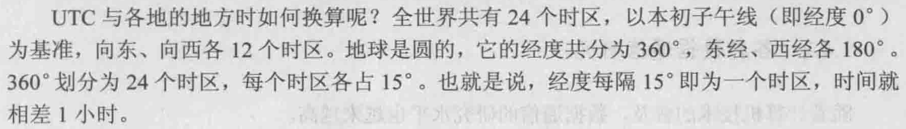
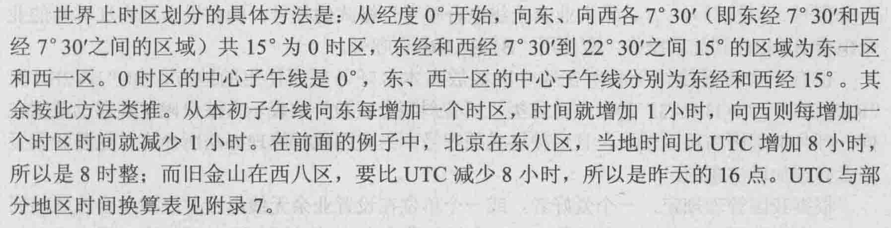

## 1.4 业余电台的活动内容是什么

业余电台活动：
	通信实践：以提高操作技能为主
	研究试验：以科研创新为目的
	工程制作：以自力更生研制设备、提高动手能力为目的
	友好交往：各国爱好者之间人员、信件往来
	所需基础：电子、物理、通信、计算机技术、外语、地理知识、爱好者个人的品德修养	

### 1.4.1 多种多样的通信操作实践

无线电通信的操作实践：ON AIR

通信方式：语言通信、等幅电报通信

① 语言通信
	根据语音信对于载频调试的不同方式划分：
		调频话：发射效率低、占用频带宽、超短波、小功率
		调幅话：发射效率低、占用频带宽、超短波、小功率
		单边带话：占用频带较窄、短波（HF），SSB方式（Single Side Band）
	通信：直接利用语言交谈
		英语明语、通信用Q简语、缩语

② 等幅电报通信，CW方式（Continuous Wave）
	短信号：“.”（点）
	长信号：“-”（划）
	CW方式：所需设备简单、占用频带很窄、发射效率高、通信距离远

### 1.4.2 各种数据通信研究

##### 1. 无线电传，RTTY（Radioteletype）

暂略

### 1.4.3 各种图像通信研究

暂略

